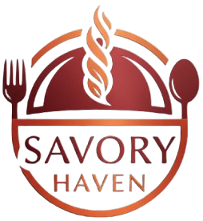

# 🍽️ Savory Haven — Restaurant Website
🌐 **Website:** [https://savory-haven-website.vercel.app/](https://savory-haven-website.vercel.app/)

---



**Savory Haven** is a modern restaurant website designed to showcase a premium dining experience online.
It highlights signature dishes, special deals, chef expertise, customer reviews, and table reservations — all in a visually rich and appetizing layout.


---

## 🌟 Overview

Savory Haven’s website acts as a **digital front door** for the restaurant. It helps turn visitors into customers by:

* Showcasing best-selling dishes
* Promoting limited-time deals
* Building trust through reviews
* Sharing the restaurant’s story and expertise
* Encouraging reservations and inquiries

It’s built to feel **elegant, warm, and high-quality**, matching the experience customers get inside the restaurant.

---

## 🍴 Key Features

### 🏠 Hero Section

* Strong headline: **“Where Every Bite Tells a Story”**
* Call-to-action buttons (Explore Menu, Book Table)
* Immediate brand positioning

### ⭐ Featured Dishes

* Popular food items with:

  * Images
  * Prices
  * Short descriptions
  * Add to cart buttons

### 🔥 Today’s Best Deals

* Promotional meal bundles
* Discount highlights
* Perfect for increasing order value

### 👨‍🍳 About the Restaurant

* Story of Savory Haven
* Chef expertise and passion
* Years of experience and achievements

### 💬 Customer Reviews

* Realistic testimonials
* Star ratings
* Builds trust and credibility

### 📍 Locations Section

* Multiple branches displayed
* Helps customers find the nearest branch

### 📅 Reservation Call-to-Action

* Clear section encouraging table booking
* Increases dine-in conversions

### 📞 Contact & Footer

* Contact details
* Opening hours
* Quick navigation links

---

## 🎯 Purpose of the Website

This website is designed to:

* Increase **restaurant visibility online**
* Attract more **walk-in and reservation customers**
* Promote **special offers and menu highlights**
* Strengthen **brand identity**
* Provide customers with essential information quickly

---

## 💻 Technology Stack


---

## 🚀 Who This Is For

This project is ideal for:

* Restaurants
* Cafés
* Food chains
* Cloud kitchens
* Hospitality businesses

It can be customized for menus, pricing, branding, and locations.

---

## 🛠️ Getting Started (For Developers)

```bash
# Install dependencies
npm install

# Run development server
npm run dev

# Build for production
npm run build
```

---

## 📌 Future Improvements

* Online ordering system
* Reservation system integration
* Admin dashboard for menu updates
* Payment gateway
* Delivery tracking

---

## 👤 Author

**Jimwell Ibay**
Frontend Developer

---

Savory Haven isn’t just a website —
it’s a **digital dining experience**. 🍷✨
